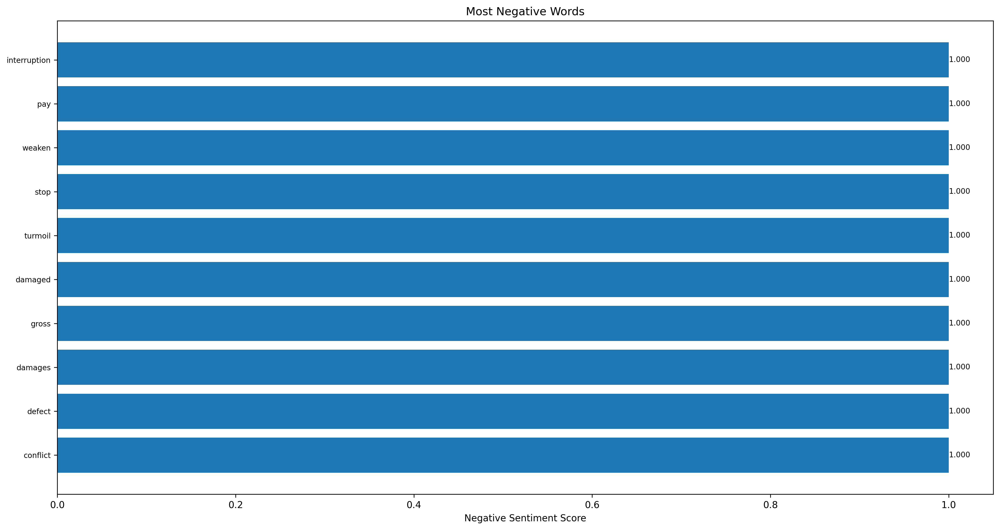

# Risk Analysis Report

Generated on: 2025-05-26 16:25:22

## Most Negative Words

The following visualization shows the words with the most negative sentiment scores:

### Top 10 Most Negative Words

- **affected** (Negative Score: 1.000)

- **risky** (Negative Score: 1.000)

- **waste** (Negative Score: 1.000)

- **anti** (Negative Score: 1.000)

- **exposes** (Negative Score: 1.000)

- **punitive** (Negative Score: 1.000)

- **uncertain** (Negative Score: 1.000)

- **infringement** (Negative Score: 1.000)

- **damages** (Negative Score: 1.000)

- **failing** (Negative Score: 1.000)

## Most Negative Sentences

The following sentences were identified as having the most negative sentiment using FinBERT:

1. **Score: 0.972** - The Company expects its quarterly revenue and operating results to fluctuate. (from risk_ffb58afc-aa5d-4b55-8d12-8e0937575a35)

2. **Score: 0.972** - The Company records a write-down for product and component inventories that have become obsolete or exceed anticipated demand, or for which cost exceeds net realizable value. (from risk_b4266e40-1de6-4a34-9dfb-8632b8bd57e0)

3. **Score: 0.971** - The Company expects its quarterly net sales and operating results to fluctuate. (from risk_1a919118-a594-44f3-92f0-4ecca47b1a7d)

4. **Score: 0.971** - Following an interruption to its business, the Company could require substantial recovery time, experience significant expenditures in order to resume operations, and lose significant revenue. (from risk_68027c6d-356d-46a4-a524-65d8ec05a1da)

5. **Score: 0.971** - The Company records a write-down for product and component inventories that have become obsolete or exceed anticipated demand or net realizable value and accrues necessary cancellation fee reserves for orders of excess products and components. (from risk_ffb58afc-aa5d-4b55-8d12-8e0937575a35)
