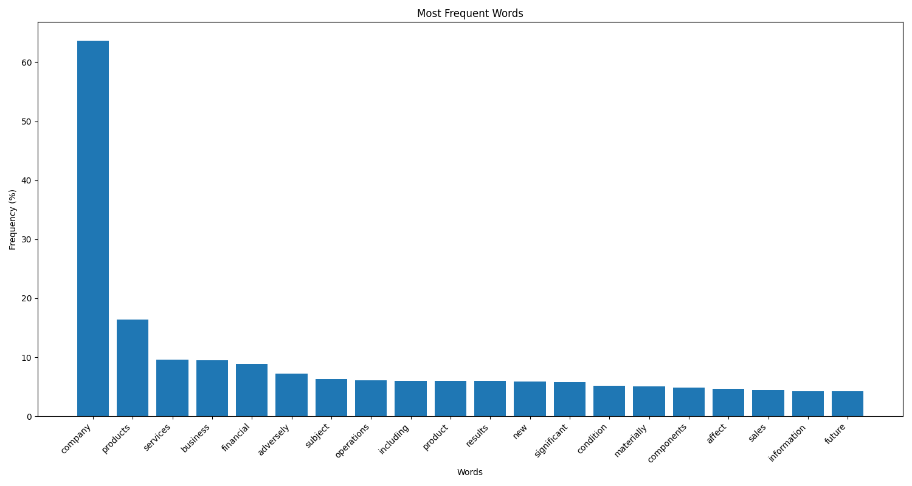

# Risk Analysis Report

Generated on: 2025-05-26 16:42:10

## Overview

This report analyzes risk factors from financial documents using three different approaches:
1. Word frequency analysis to identify commonly used terms
2. Sentiment analysis of individual words using VADER
3. Sentence-level sentiment analysis using FinBERT

## Word Frequency Analysis

The following visualization shows the 20 most frequently occurring words in the risk factors, regardless of their sentiment. This helps identify key themes and topics in the risk sections.

## Negative Word Analysis

This section shows words with the strongest negative sentiment scores, as determined by VADER sentiment analysis. The scores range from 0 (neutral) to 1 (extremely negative).

### Top 10 Most Negative Words

- **conflict** (Negative Score: 1.000)

- **defect** (Negative Score: 1.000)

- **damages** (Negative Score: 1.000)

- **gross** (Negative Score: 1.000)

- **damaged** (Negative Score: 1.000)

- **turmoil** (Negative Score: 1.000)

- **stop** (Negative Score: 1.000)

- **weaken** (Negative Score: 1.000)

- **pay** (Negative Score: 1.000)

- **interruption** (Negative Score: 1.000)

## Negative Sentence Analysis

The following sentences were identified as having the most negative sentiment using FinBERT, a specialized financial sentiment analysis model. The scores represent the model's confidence in the negative sentiment.

1. **Score: 0.972** - The Company expects its quarterly revenue and operating results to fluctuate. (from risk_ffb58afc-aa5d-4b55-8d12-8e0937575a35)

2. **Score: 0.972** - The Company records a write-down for product and component inventories that have become obsolete or exceed anticipated demand, or for which cost exceeds net realizable value. (from risk_b4266e40-1de6-4a34-9dfb-8632b8bd57e0)

3. **Score: 0.971** - The Company expects its quarterly net sales and operating results to fluctuate. (from risk_1a919118-a594-44f3-92f0-4ecca47b1a7d)

4. **Score: 0.971** - Following an interruption to its business, the Company could require substantial recovery time, experience significant expenditures in order to resume operations, and lose significant revenue. (from risk_68027c6d-356d-46a4-a524-65d8ec05a1da)

5. **Score: 0.971** - The Company records a write-down for product and component inventories that have become obsolete or exceed anticipated demand or net realizable value and accrues necessary cancellation fee reserves for orders of excess products and components. (from risk_ffb58afc-aa5d-4b55-8d12-8e0937575a35)
